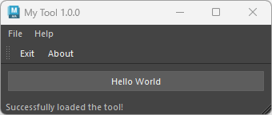
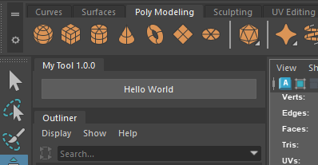

# maya pyside ui templates
Simple templates by PySide widgets for Maya

||||
|---|---|---|
|`basic_window.py`|Window that can configure menu bar, toolbar, and status bar||
|`dockable_widget.py`|Widget that can be docked to Maya UI. Can be restored on next Maya launch.||

References:
- [Qt for Python](https://doc.qt.io/qtforpython-6/)
- [Writing Workspace controls (Maya Developer Help Center)](https://help.autodesk.com/view/MAYADEV/2026/ENU/?guid=Maya_DEVHELP_Maya_Python_API_Writing_Workspace_controls_html)